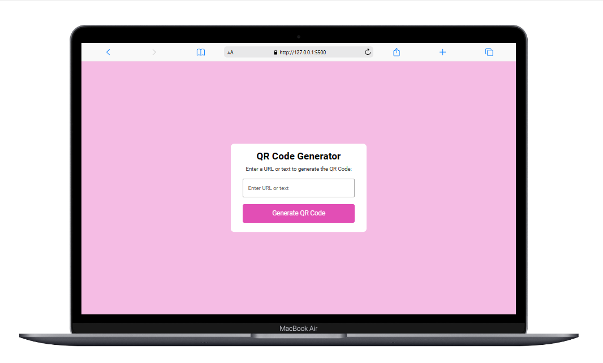

<h1 align="center">QR Code Generator</h1>

  <a href="#-project">Project</a>&nbsp;&nbsp;&nbsp;|&nbsp;&nbsp;&nbsp;
  <a href="#-technologies-used">Technologies</a>&nbsp;&nbsp;&nbsp;|&nbsp;&nbsp;&nbsp;
  <a href="#-preview">Preview</a>

  

## 💻 Project
This is a simple web application that allows users to generate QR codes by entering a URL or text.

## ✨ Technologies used:
- HTML
- CSS
- JavaScript

## ⚙️ Features
- Generate QR codes from URLs or text input
- Easy to use interface
- Supports various formats of QR codes

## 🔗 Preview
<a href="https://isabelaolsemann.github.io/QRCodeGenerator/" target="_blank">View QR Code Generator</a>

---
This website was developed by Isabela Olsemann, building upon skills learned during front-end course of Matheus Battisti.
